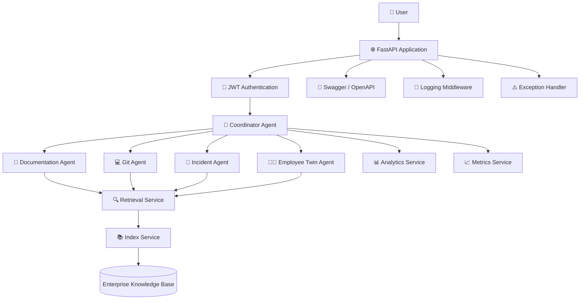

# HiveMind Architecture Diagram



---

# Request Flow

```text
User
   │
   ▼
FastAPI API
   │
JWT Authentication
   │
Coordinator Agent
   │
 ┌──────────────┬───────────────┬───────────────┬──────────────┐
 ▼              ▼               ▼              ▼
Documentation   Git          Incident      Employee Twin
 Agent          Agent          Agent           Agent
        \          |            |            /
         \         |            |           /
          └────────┴────────────┴──────────┘
                        │
                        ▼
               Retrieval Service
                        │
                        ▼
                  Index Service
                        │
                        ▼
            Enterprise Knowledge Base
                        │
                        ▼
              Response Generation
                        │
                        ▼
                    API Response
```

---

# Component Responsibilities

| Component           | Responsibility                                          |
| ------------------- | ------------------------------------------------------- |
| FastAPI             | REST API endpoints and Swagger UI                       |
| JWT Authentication  | User authentication and endpoint protection             |
| Coordinator Agent   | Determines which specialised agents process the request |
| Documentation Agent | Searches documentation and architecture files           |
| Git Agent           | Searches repository and implementation knowledge        |
| Incident Agent      | Searches incident reports and RCA documents             |
| Employee Twin Agent | Finds SMEs and ownership information                    |
| Retrieval Service   | Retrieves and ranks relevant documents                  |
| Index Service       | Loads and caches enterprise knowledge                   |
| Analytics Service   | Tracks searches and usage statistics                    |
| Metrics Service     | Provides application metrics and health information     |
| Knowledge Base      | Stores enterprise documents and knowledge               |

---

# Future Architecture

```
                        User
                          │
                          ▼
                     React Frontend
                          │
                          ▼
                    FastAPI Backend
                          │
                     JWT Authentication
                          │
                   Coordinator Agent
                          │
          ┌───────────────┼────────────────┐
          ▼               ▼                ▼
   Existing Agents   New AI Agents   Future AI Agents
                          │
                          ▼
                   Vector Search (FAISS)
                          │
                          ▼
                     Amazon Bedrock
                          │
                          ▼
                   Large Language Model
                          │
                          ▼
                 Intelligent AI Responses
                          │
                          ▼
                   Cloud Deployment (AWS)
```

This future architecture shows how HiveMind can evolve from a keyword-based multi-agent platform into an enterprise-grade Agentic AI system powered by semantic search, vector databases, and foundation models while keeping the current coordinator-based design.
